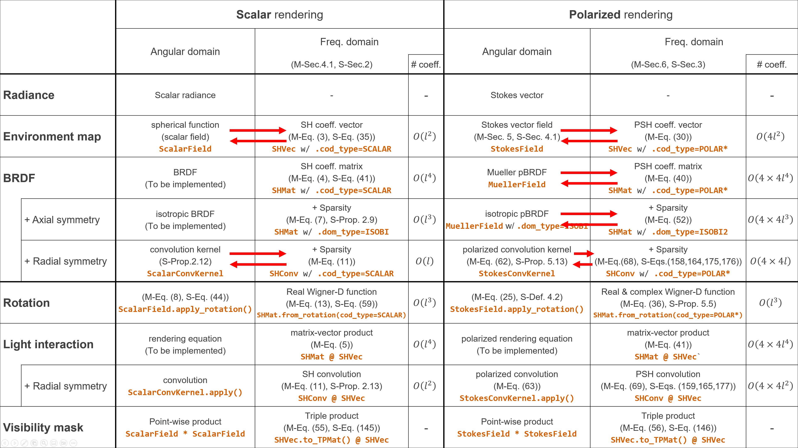
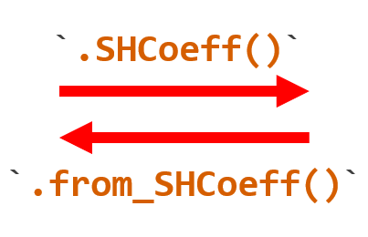

# Polarized Spherical Harmonics

[Project Page](https://vclab.kaist.ac.kr/siggraph2024/index.html) | [Paper](https://vclab.kaist.ac.kr/siggraph2024/polar-harmonics-main.pdf) | [Supplemental document](https://vclab.kaist.ac.kr/siggraph2024/polar-harmonics-supp.pdf) | Presentation

**Authors:** Shinyoung Yi ([syyi@vclab.kaist.ac.kr](mailto:syyi@vclab.kaist.ac.kr)), Donggun Kim ([dgkim@vclab.kaist.ac.kr](mailto:dgkim@vclab.kaist.ac.kr)), Jiwoon Na ([jwna@vclab.kaist.ac.kr](mailto:jwna@vclab.kaist.ac.kr)), Xin Tong ([xtong.gfx@gmail.com](mailto:xtong.gfx@gmail.com)), Min H. Kim ([minhkim@kaist.ac.kr](mailto:minhkim@kaist.ac.kr))

**Institute:** [KAIST Visual Computing Laboratory](https://vclab.kaist.ac.kr)

```
@Article{pHarmonics:SIG:2024,
  author  = {Shinyoung Yi and Donggun Kim and Jiwoong Na and 
             Xin Tong and Min H. Kim},
  title   = {Spin-Weighted Spherical Harmonics for 
             Polarized Light Transport},
  journal = {ACM Transactions on Graphics (Proc. SIGGRAPH 2024)},
  year    = {2024},
  volume  = {43},
  number  = {4},
}
```

## Installation

```shell
pip install "numpy==1.26" matplotlib opencv-python tqdm tabulate spherical
pip install ipykernel PyQt5 "vispy>=0.14.3" jupyter_rfb PyOpenGL PyOpenGL_accelerate
```

(optional) For reproducing Figure 13 in the paper:

* ```shell
  pip install mitsuba
  ```
* If you are not planning to test to run `tutorial/reproduce.py` with removing precomputed data `tutorial/output/vis_mask_*.npy`, if dependency is not needed.

```shell
cd polarsh
pip install .
```

### Requirements

* Python 3.11

## Dependencies

All dependencies will be installed as specified in the Installation section, but their flexibility and usage are outlined here. The dependencies that each package has are indented under the top-level package, as shown below.

First, for general numeric computations:

* NumPy
* SciPy
* Matplotlib: image and matrices visualization (`.matshow()` methods in `psh.SHVec` and `psh.SHMat` classes)
* OpenCV Python: Only used for `imread()` and `imwrite()` functions in `polarsh/polarsh/image.py`
* tqdm
* tabulate

Our computational methods for speical functions, including (spin-weighted) spherical harmonics and Wigner D-functions, are based on:

* [spherical](https://spherical.readthedocs.io/en/main/)
  * Numba
  * [quaternionic](https://quaternionic.readthedocs.io/en/latest/)

For 3D visualization for spherical objects (`.visualize()` methods in `psh.SphereGrid`, `psh.SphereFrameField`, `psh.StokesField` classes)

* [VisPy](https://vispy.org/index.html)
  * PyQt5: A backend of VisPy. Using other backend library listed in [here](https://vispy.org/installation.html#backend-requirements) instead of PyQt5 will work too
  * PyOpenGL: Required for using [instanced mesh](https://vispy.org/api/vispy.scene.visuals.html#vispy.scene.visuals.InstancedMesh) objects in VisPy, which we use for frames and Stokes vectors on spheres
  * [jupyter_rfb](https://jupyter-rfb.readthedocs.io/en/stable/): Interactive 3D visualization of VisPy embedded in Python Jupyter notebook tutorials

For Jupyter notebook tutorials (`tutorial/*.ipynb`)

* IPython Kernel (ipykernel)

(Optional) For reproduction of Figure 13.

* [Mitsuba 3](https://www.mitsuba-renderer.org/)
  * Note that it will only be needed if you are trying to run `tutorial/reproduce.py` after removing the data files named `tutorial/output/vis_mask_*.npy`
  * We only use Mitsuba 3 for the ray intersection queries to obtain a visibility function.

## Usage

```python
import numpy as np
import matplotlib.pyplot as plt
import polarsh as psh
from vispy import app

# Load a polarized envirionment map data
stkF = psh.StokesField.from_cubeimage(psh.data_dir/"sponza_64_s%d.exr")

# Project into a polarized SH coefficient vector
level = 5
shv = stkF.SHCoeff(level)
shv.matshow(0, title="Polarzied spherical harmonics coefficient vector:\n"
                     "frequency doamin information of a Stokes vector field") # `0` for the first R channel among RGB
plt.show()

# Band limited polarized environment map with finite coefficients
stkF_rec = psh.StokesField.from_SHCoeff(shv, stkF.SphFF)

# Rotation operation in the PSH domain (frequency domain)
rotvec = [np.pi/2, 0, 0]
shv_rot = rotvec @ shv

# Band limited polarized environment map, rotated in the PSH domain
stkF_rot_rec = psh.StokesField.from_SHCoeff(shv_rot, stkF.SphFF)

# `polarsh` supports 3D visualization for each spherical object
cfg = dict(arrow_dsamp=4)
with psh.visualize_layout(1, 3, figsize=(1200, 400)):
    stkF.visualize(**cfg, title="Stokes vector field, initial")
    stkF_rec.visualize(**cfg, title="Frequency limited")
    stkF_rot_rec.visualize(**cfg, title="Rotated in freq. (PSH) domain")
app.run()
```

### Reproduce figures in the paper

We provide a single python script which reproduce Figures 5, 6, 10, 11, 13, 16, and 17 in our paper.

```shell
cd tutorial
python reproduce.py [--mode={full,simple}] [--remove_cache]
```

If the `mode` argument was set to `full` (default), the script exactly reproduce the figures. If the argument was set to `simple`, then the script generates a simplified version of the figures based on low image resolutions and low frequency bands. If you are simply aimed to check whether the reproduction process properly works on your environment, then the `simple` mode will be better.

In this repository, the generated figure images have been already stored in `tutorial/reproduce/figure` (`full` mode) and `tutorial/reproduce/figure_simple` (`simple` mode). Data used in the figures have been also stored in `tutorial/reproduce/output` (`full` mode) and `tutorial/reproduce/output_simple` (`simple` mode), without loss of information.

When you run this reproduction script then it will first try to load cached data from `tutorial/reproduce/output[_simple]`. If you want to try the all process of the reproduction then you can add an argument `--remove_cache` which remove all the cached data.

With each combination of arguments, the estimated running time would be:

* `python reproduce.py --remove_cache` (`full` mode as default)
  * 1-2 days
  * If you manually remove cached data files in `tutorial/reproduce/output` excepting two files formed `nvRotMat_L15*.npy`, which are the most time consuming part, then it will take about 3 hours.
* `python reproduce.py` (`full` mode as default)
  * 8 minutes
* `python reproduce.py --mode=simple --remove_cache`
  * 90 seconds
* `python reproduce.py --mode=simple`
  * 27 seconds

## Tutorial

We provide Jupyter notebook tutorials including interactive 3D visualizations of various types of spherical objects, including scalar fields, frame fields, and Stokes vector fields.

<video src="tutorial/tutorial_figure/tutorial_0_video.mp4"></video>

https://github.com/user-attachments/assets/bfd07148-4f2d-4e51-ac68-3c3ac9a5c5af

`tutorial/0_quickstart.ipynb` provides a brief summary of our contribution usage of our API. For more details,`tutorial/1_sphericalfunctions.ipynb` to `tutorial/6_polarized_spherical_convolution.ipynb`  covers background of spherical harmonics, polarization and Mueller calculus, and our polarized spherical harmonics. We refer to [`tutorial.readme.md`](./tutorial/readme.md) for user guide for each tutorial.

## Tested environment

* Windows 11
* Python 3.11.7
* Anaconda 23.11.0
* NumPy 1.26.3
* SciPy 1.11.4
* Numba 0.58.1
* [quaternionic](https://quaternionic.readthedocs.io/en/latest/) 1.0.8
* [spherical](https://spherical.readthedocs.io/en/main/) 1.0.14
* Matplotlib 3.8.2
* PyOpenGL 3.1.7
* [VisPy](https://vispy.org/index.html) 0.14.3
* [jupyter_rfb](https://jupyter-rfb.readthedocs.io/en/stable/) 0.4.2
* [Mitsuba](https://www.mitsuba-renderer.org/) 3.5.2

## Relationship with the paper

### Supplemental Table 1 with relevant classes and methods in `polarsh` package




